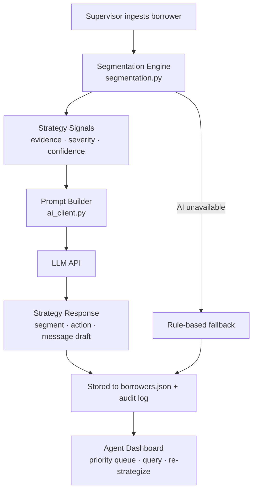

# AI-Based Collections Strategy Optimizer

An AI-assisted collections strategy assistant for delinquent borrowers. It segments accounts, recommends the next best outreach action, suggests channel and timing, and generates empathetic, compliant message drafts — all grounded in deterministic segmentation logic.

> **Note:** Prototype built for a take-home assessment, not a production system.

---

## Quick Start

```bash
pip install -r requirements.txt
python3 app.py
```

Open **http://localhost:8000** in your browser.

Set `LLM_WRAPPER_TOKEN` in `.env` for live AI responses. Without it, the system falls back to rule-based strategy and message templates.

Copy `.env.example` to `.env` and set `AGENT_API_KEY` / `SUPERVISOR_API_KEY` before running.

### Run tests

```bash
pytest
```

---

## Architecture



---

## File Reference

| File | Purpose |
|---|---|
| `app.py` | Entry point — starts Uvicorn server |
| `backend/main.py` | FastAPI routes and request orchestration |
| `backend/segmentation.py` | Borrower segmentation and next-best-action engine |
| `backend/ai_client.py` | Prompt builder, LLM caller, message sanitization |
| `backend/data.py` | Read/write `borrowers.json` |
| `backend/models.py` | Pydantic request/response models |
| `backend/config.py` | Environment configuration and security constants |
| `backend/security.py` | API-key auth, rate limiting, PII redaction, security headers |
| `backend/dependencies.py` | FastAPI auth dependencies |
| `tests/` | Pytest suite (segmentation, API, security, data, AI client) |
| `static/index.html` | Single-file frontend (agent dashboard + supervisor ingest) |

---

## Security

| Control | Implementation |
|---|---|
| **Authentication** | `X-API-Key` header — role derived from key, not client-declared |
| **Authorization** | Supervisor-only ingest; agent/supervisor read & strategize |
| **PII isolation** | Agents see masked phone/email in list view; AI audit payloads supervisor-only |
| **Input validation** | Pydantic enums, length limits, email/phone regex, borrower ID format |
| **Rate limiting** | Per API key / IP (configurable via env) |
| **Security headers** | CSP, X-Frame-Options, nosniff, no-store cache |
| **CORS** | Restricted to configured origins |
| **Error handling** | Generic 500 messages — no stack traces leaked to clients |
| **Message safety** | AI drafts sanitized to strip threatening language |
| **File locking** | `fcntl` lock on JSON writes to reduce corruption risk |

**Prototype keys** (change before any real deployment):

```
AGENT_API_KEY=dev-agent-key-change-me
SUPERVISOR_API_KEY=dev-supervisor-key-change-me
```

Set `APP_ENV=production` to enforce non-default API keys at startup.

| Field | Type | Description |
|---|---|---|
| `name`, `phone`, `email` | string | Borrower contact info |
| `loan_amount` | float | Original loan amount (₹) |
| `days_past_due` | int | Days since last due payment |
| `overdue_amount` | float | Current overdue balance (₹) |
| `prior_payment_behavior` | enum | `on_time` · `occasional_late` · `chronic_late` |
| `preferred_channel` | enum | `sms` · `email` · `call` |
| `hardship_indicators` | string[] | e.g. `job_loss`, `medical`, `business_closure` |
| `response_history` | object[] | Past outreach: channel, date, responded, outcome |
| `repayment_promises` | object[] | Promised amounts and whether kept |
| `partial_payments_last_30d` | float | Partial payments showing payment intent |

---

## Segmentation Rules

| Segment | Rule logic |
|---|---|
| **Willing but Delayed** | DPD ≤ 30, good history, partial payments or responsive |
| **Habitual Late Payer** | Occasional/chronic late history, DPD 15–60 |
| **Hardship Case** | Hardship indicators present, engages when contacted |
| **Unresponsive** | 3+ consecutive outreach attempts with no response |
| **High-Risk Escalation** | DPD ≥ 90 with broken promises or severe delinquency |

### Rule Precedence Order (Conflict Resolution)
If a borrower matches criteria for multiple segments, the engine resolves conflicts in the following sequence (first match wins):
1. **High-Risk Escalation** (Highest precedence) — Active severe delinquency (DPD ≥ 90) with high broken promise counts or consecutive unresponsiveness.
2. **Unresponsive** — 3+ consecutive failed outreach attempts.
3. **Hardship Case** — Presence of documented hardship indicators (job loss, medical emergency, etc.).
4. **Habitual Late Payer** — Chronic/occasional late payment history.
5. **Willing but Delayed** (Lowest precedence) — Early DPD ≤ 30, no broken promises, or partial payment showing active intent.

## Next-Best-Action Matrix

| Segment | Primary action |
|---|---|
| Willing but Delayed | SMS Reminder / Email |
| Habitual Late Payer | Payment Plan Offer |
| Hardship Case | Hardship Support |
| Unresponsive | Agent Call |
| High-Risk Escalation | Escalation / Manual Review |

---

## Strategy Signals (8 checks)

All signals are deterministic — the AI never invents new ones.

| Signal | What it detects |
|---|---|
| **Early/Moderate/Advanced/Severe Delinquency** | DPD bucket severity |
| **Low/Moderate/High Overdue Ratio** | Overdue vs loan amount |
| **Payment History Pattern** | On-time vs chronic late behavior |
| **Broken Repayment Promise** | Unkept payment commitments |
| **Unresponsive / Declining Responsiveness** | Outreach response streak |
| **Hardship Indicators** | Documented hardship flags |
| **Partial Payment Intent** | Recent partial payments |
| **Insufficient Data** | Missing required fields |

---

## API Endpoints

| Method | Path | Role | Description |
|---|---|---|---|
| POST | `/borrowers` | supervisor | Ingest borrower + generate strategy |
| GET | `/borrowers` | agent, supervisor | List borrowers (priority sorted) |
| GET | `/borrowers/{id}` | agent, supervisor | Borrower detail + signals |
| GET | `/dashboard/priority` | agent, supervisor | Priority workload queue |
| POST | `/borrowers/{id}/query` | agent, supervisor | Explainability Q&A |
| POST | `/borrowers/{id}/re-strategize` | agent, supervisor | Refresh AI strategy |

Access control uses the `X-API-Key` header. Role is resolved server-side from the key — clients cannot spoof roles.

### Error Responses
All HTTP exceptions use FastAPI's standard detail shape:
```json
{
  "detail": "Error message description string."
}
```
**Status Codes Used:**
* `200 OK` — Success.
* `400 Bad Request` — Invalid Borrower ID formats.
* `401 Unauthorized` — Missing or invalid `X-API-Key`.
* `403 Forbidden` — Action restricted to another role (e.g. Agent trying to Ingest).
* `404 Not Found` — Borrower record does not exist.
* `422 Unprocessable Entity` — Request schema validation failure (e.g., bad email format or query question length < 3 chars).
* `429 Too Many Requests` — Rate limit threshold exceeded.
* `500 Internal Server Error` — Unhandled exception shielded for client safety.

---

## API Request & Response Examples

### 1. Ingest Borrower (`POST /borrowers`)
* **Request Headers:**
  `X-API-Key: dev-supervisor-key-change-me`
* **JSON Request Payload:**
  ```json
  {
    "name": "Priya Sharma",
    "phone": "+91-98765-43210",
    "email": "priya@email.com",
    "loan_amount": 50000,
    "days_past_due": 15,
    "overdue_amount": 5000,
    "prior_payment_behavior": "on_time",
    "preferred_channel": "sms",
    "hardship_indicators": ["job_loss"],
    "response_history": [],
    "repayment_promises": [],
    "partial_payments_last_30d": 0
  }
  ```
* **JSON Response Payload:**
  ```json
  {
    "borrower_id": "BOR021",
    "segment": "Hardship Case",
    "next_best_action": "Hardship Support",
    "recommended_channel": "sms",
    "recommended_time": "Weekday 10:00–11:00 AM (default business hours)",
    "message_draft": "Hi Priya, we're aware you may be going through a difficult time. Our hardship support team can help review your account and explore accommodations for your ₹5,000 balance.",
    "strategy_rationale": "• Account is 15 DPD (Early Delinquency).\n• Overdue ₹5,000 is 10% of loan.\n• Borrower historically pays on time.\n• No prior outreach recorded.\n• Hardship indicators reported: job_loss.",
    "strategy_signals": [
      {
        "type": "Early Delinquency",
        "severity": "Low",
        "confidence": "High (90%)",
        "evidence": "Account is 15 days past due — early-stage delinquency."
      },
      {
        "type": "Low Overdue Ratio",
        "severity": "Low",
        "confidence": "High (85%)",
        "evidence": "Overdue ₹5,000 is 10% of loan — relatively small balance outstanding."
      },
      {
        "type": "Strong Payment History",
        "severity": "Low",
        "confidence": "High (85%)",
        "evidence": "Borrower historically pays on time — likely temporary delay."
      },
      {
        "type": "No Outreach History",
        "severity": "Low",
        "confidence": "Medium (70%)",
        "evidence": "No prior outreach recorded — initial contact recommended."
      },
      {
        "type": "Hardship Indicators",
        "severity": "Medium",
        "confidence": "High (90%)",
        "evidence": "Hardship indicators reported: job_loss. Empathetic, support-oriented outreach recommended."
      }
    ],
    "recovery_probability": 0.68,
    "priority_score": 24.9
  }
  ```

### 2. Strategy Explainability Query (`POST /borrowers/{id}/query`)
* **Request Headers:**
  `X-API-Key: dev-agent-key-change-me`
* **JSON Request Payload:**
  ```json
  {
    "question": "Why is this borrower assigned to hardship support?"
  }
  ```
* **JSON Response Payload:**
  ```json
  {
    "answer": "Priya Sharma is assigned to hardship support because the rule-engine detected active hardship indicators (job_loss). In alignment with our compliance and lending guidelines, hardship cases are routed to the support desk to explore repayment modifications (like a temporary moratorium) rather than standard collection reminders."
  }
  ```

---

## Workload Priority & Recovery Formulas

### 1. Workload Priority Score
Determines the sequence in which collections agents process tasks. The score ranges from `0` to `100` and is calculated as:
$$\text{Priority Score} = \text{Urgency (40\%)} + \text{Value (30\%)} + \text{Engagement (15\%)} + \text{Intent Boost (10\%)} + \text{Probability Boost (5\%)}$$

*   **Urgency (Max 40 pts):** $\min(\text{Days Past Due} / 120.0, 1.0) \times 40$
*   **Value (Max 30 pts):** $\min(\text{Overdue Amount} / 100,000.0, 1.0) \times 30$
*   **Engagement (Max 15 pts):** $(1.0 - \text{Unresponsive Attempts} / 5.0) \times 15$ (bounded between $0$ and $15$)
*   **Intent Boost (Max 10 pts):** $+10$ points if there were partial payments in the last 30 days.
*   **Probability Boost (Max 5 pts):** $\text{Recovery Probability} \times 5$

### 2. Recovery Probability
A rule-based estimation of the likelihood that the borrower will settle their overdue balance. It starts at a base rate of `0.55` (55%) and adjusts as follows:
*   **Base Rate:** `0.55`
*   **Prior Behavior Adjustments:** `on_time` ($+0.15$), `occasional_late` ($+0.05$), `chronic_late` ($-0.10$).
*   **Delinquency Penalty:** $-\min(\text{Days Past Due} / 200.0, 0.25)$ (up to $-0.25$ penalty).
*   **Intent Boost:** $+0.10$ if partial payments exist in the last 30 days.
*   **Hardship Offset:** $+0.05$ (accounts under active hardship support tend to recover better).
*   **Broken Promise Penalty:** $-0.08$ per broken payment promise.
*   **Unresponsiveness Penalty:** $-0.05$ per consecutive failed outreach attempt.
*   **Bounds:** Clipped strictly between `0.05` and `0.95`.

---

## Prompt Template & LLM Wrapper Contract

### Prompt Template Skeleton
The prompt sent to the LLM wrapper enforces strict guidelines, compliance bounds, and grounds the agent's actions only in rule-based signals:
```markdown
You are a collections strategy assistant for a regulated fintech lender. Recommend respectful, compliant outreach grounded ONLY in the data below.

BORROWER DATA:
Name: {name}
Phone: {phone}
Email: {email}
Loan Amount: ₹{loan_amount}
Days Past Due: {days_past_due}
Overdue Amount: ₹{overdue_amount}
Prior Payment Behavior: {prior_payment_behavior}
Preferred Channel: {preferred_channel}
Hardship Indicators: {hardship_indicators}
Partial Payments (last 30 days): ₹{partial_payments_last_30d}

OUTREACH HISTORY:
{formatted_history}

REPAYMENT PROMISES:
{formatted_promises}

STRATEGY SIGNALS (from rule engine — do NOT invent new ones):
{formatted_signals}

RULE-ENGINE PRELIMINARY RECOMMENDATION:
Segment: {preliminary_segment}
Next Best Action: {preliminary_action}
Suggested Channel: {recommended_channel}
Suggested Time: {recommended_time}
Estimated Recovery Probability: {recovery_probability}

ALLOWED SEGMENTS (use exactly one): Habitual Late Payer, Hardship Case, High-Risk Escalation, Unresponsive, Willing but Delayed
ALLOWED ACTIONS (use exactly one): Agent Call, Email, Escalation, Hardship Support, Manual Review, Payment Plan Offer, SMS Reminder

COMPLIANCE & TONE RULES:
- Use empathetic, respectful language. Never threaten, harass, or use aggressive legal language.
- The message_draft must be customer-safe and suitable for SMS/email — warm, clear, and professional.
- Ground every decision in the signals and borrower data above. Do NOT invent facts.
- segment and next_best_action should align with the preliminary recommendation unless signals clearly contradict it.
- strategy_rationale: one bullet (•) per strategy signal, max 5 bullets, each under 25 words.

Respond with ONLY valid JSON, no markdown:
{"segment": "...", "next_best_action": "...", "recommended_channel": "...", "recommended_time": "...", "message_draft": "...", "strategy_rationale": "• point one\n• point two", "recovery_probability": 0.65}
```

### LLM Wrapper Request Payload
```json
{
  "prompt": "Full compiled prompt text containing borrower history and rule signals..."
}
```

### LLM Wrapper Response Payload
The client expects a JSON response containing the text under one of these keys (`reply`, `response`, `content`, `text`):
```json
{
  "reply": "{\n  \"segment\": \"Hardship Case\",\n  \"next_best_action\": \"Hardship Support\",\n  \"recommended_channel\": \"sms\",\n  \"recommended_time\": \"Weekday 10:00 AM\",\n  \"message_draft\": \"Hi Priya, ...\",\n  \"strategy_rationale\": \"• Account is 15 days past due...\",\n  \"recovery_probability\": 0.68\n}"
}
```

---

## Key Design Decisions

| Decision | Why | Trade-off |
|---|---|---|
| Segmentation engine feeds AI | Prevents hallucination; auditable recommendations | Novel patterns need new rules |
| Empathetic message sanitization | Compliance — no threatening language | AI drafts may need human review before send |
| Flat JSON storage | Zero-config prototype | No concurrent write safety |
| Header-based API key auth | Role bound to secret key, not spoofable header | Keys must be rotated and stored in a secrets manager in production |
| Priority score formula | Agent workload prioritization | Weights are hand-tuned |

---

## Security & Privacy (Prototype vs Production)

### Data Isolation Enforcement
*   **Prototype (Role-Based Partitioning):**
    *   **Agents** see masked PII (email/phone) in the list dashboard, and the system automatically strips raw AI prompts and responses (`ai_prompt_sent` and `ai_raw_response`) from their response payload in both list and detail views.
    *   **Supervisors** are authorized to access unmasked PII and full AI prompts/responses for system audit logs.
*   **Production Vision (Per-Agent Isolation):**
    *   Bind borrowers to specific collections agents in the database.
    *   Enforce a database-level where-clause query filter so agents are only authorized to read or update their own assigned caseload records.
    *   Use OAuth 2.0/OIDC JWTs with role claims, encrypted PII at rest, append-only audit logs to SIEM, and WAF rate limiting.

---

## Testing

```bash
pytest                    # run full suite
pytest tests/test_api.py  # API + auth integration tests
pytest tests/test_segmentation.py  # rule engine unit tests
```

Tests use an isolated temp database and mock LLM calls — no live API keys or LLM Wrapper access required.

---

## Bonus Features

- **Recovery probability estimate** — rule-based 0–1 score per borrower
- **Agent priority dashboard** — borrowers sorted by priority score with visual queue
- **Action audit log** — recommended actions stored per borrower with timestamps

---

## Sample Data

`borrowers.json` contains **20 pre-seeded delinquent borrowers** spanning all five segments.

---

## Limitations & Assumptions

- No real telephony, SMS, or payment gateway integrations
- Outreach history is synthetic mock data
- Authentication via API keys (see `.env.example`)
- Legal/compliance workflows simplified
- No concurrent write safety on JSON storage
- Recovery probability is rule-based, not ML-trained
