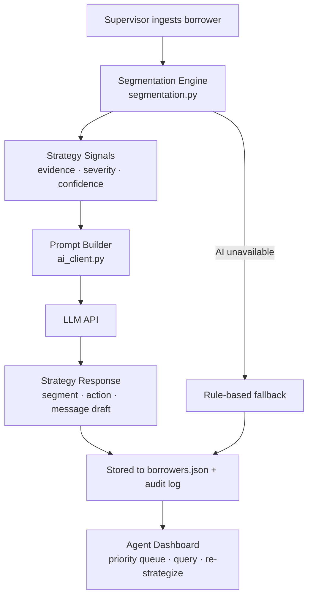

# AI-Based Collections Strategy Optimizer

An AI-assisted collections strategy assistant for delinquent borrowers. It segments accounts, recommends the next best outreach action, suggests channel and timing, and generates empathetic, compliant message drafts — all grounded in deterministic segmentation logic.

> **Note:** Prototype built for a take-home assessment, not a production system.

---

## Quick Start

```bash
pip install -r requirements.txt
python3 app.py
```

Open **http://localhost:8000** in your browser.

Set `LLM_WRAPPER_TOKEN` in `.env` for live AI responses. Without it, the system falls back to rule-based strategy and message templates.

Copy `.env.example` to `.env` and set `AGENT_API_KEY` / `SUPERVISOR_API_KEY` before running.

### Run tests

```bash
pytest
```

---

## Architecture



---

## File Reference

| File | Purpose |
|---|---|
| `app.py` | Entry point — starts Uvicorn server |
| `backend/main.py` | FastAPI routes and request orchestration |
| `backend/segmentation.py` | Borrower segmentation and next-best-action engine |
| `backend/ai_client.py` | Prompt builder, LLM caller, message sanitization |
| `backend/data.py` | Read/write `borrowers.json` |
| `backend/models.py` | Pydantic request/response models |
| `backend/config.py` | Environment configuration and security constants |
| `backend/security.py` | API-key auth, rate limiting, PII redaction, security headers |
| `backend/dependencies.py` | FastAPI auth dependencies |
| `tests/` | Pytest suite (segmentation, API, security, data, AI client) |
| `static/index.html` | Single-file frontend (agent dashboard + supervisor ingest) |

---

## Security

| Control | Implementation |
|---|---|
| **Authentication** | `X-API-Key` header — role derived from key, not client-declared |
| **Authorization** | Supervisor-only ingest; agent/supervisor read & strategize |
| **PII isolation** | Agents see masked phone/email in list view; AI audit payloads supervisor-only |
| **Input validation** | Pydantic enums, length limits, email/phone regex, borrower ID format |
| **Rate limiting** | Per API key / IP (configurable via env) |
| **Security headers** | CSP, X-Frame-Options, nosniff, no-store cache |
| **CORS** | Restricted to configured origins |
| **Error handling** | Generic 500 messages — no stack traces leaked to clients |
| **Message safety** | AI drafts sanitized to strip threatening language |
| **File locking** | `fcntl` lock on JSON writes to reduce corruption risk |

**Prototype keys** (change before any real deployment):

```
AGENT_API_KEY=dev-agent-key-change-me
SUPERVISOR_API_KEY=dev-supervisor-key-change-me
```

Set `APP_ENV=production` to enforce non-default API keys at startup.

| Field | Type | Description |
|---|---|---|
| `name`, `phone`, `email` | string | Borrower contact info |
| `loan_amount` | float | Original loan amount (₹) |
| `days_past_due` | int | Days since last due payment |
| `overdue_amount` | float | Current overdue balance (₹) |
| `prior_payment_behavior` | enum | `on_time` · `occasional_late` · `chronic_late` |
| `preferred_channel` | enum | `sms` · `email` · `call` |
| `hardship_indicators` | string[] | e.g. `job_loss`, `medical`, `business_closure` |
| `response_history` | object[] | Past outreach: channel, date, responded, outcome |
| `repayment_promises` | object[] | Promised amounts and whether kept |
| `partial_payments_last_30d` | float | Partial payments showing payment intent |

---

## Segmentation Rules

| Segment | Rule logic |
|---|---|
| **Willing but Delayed** | DPD ≤ 30, good history, partial payments or responsive |
| **Habitual Late Payer** | Occasional/chronic late history, DPD 15–60 |
| **Hardship Case** | Hardship indicators present, engages when contacted |
| **Unresponsive** | 3+ consecutive outreach attempts with no response |
| **High-Risk Escalation** | DPD ≥ 90 with broken promises or severe delinquency |

## Next-Best-Action Matrix

| Segment | Primary action |
|---|---|
| Willing but Delayed | SMS Reminder / Email |
| Habitual Late Payer | Payment Plan Offer |
| Hardship Case | Hardship Support |
| Unresponsive | Agent Call |
| High-Risk Escalation | Escalation / Manual Review |

---

## Strategy Signals (8 checks)

All signals are deterministic — the AI never invents new ones.

| Signal | What it detects |
|---|---|
| **Early/Moderate/Advanced/Severe Delinquency** | DPD bucket severity |
| **Low/Moderate/High Overdue Ratio** | Overdue vs loan amount |
| **Payment History Pattern** | On-time vs chronic late behavior |
| **Broken Repayment Promise** | Unkept payment commitments |
| **Unresponsive / Declining Responsiveness** | Outreach response streak |
| **Hardship Indicators** | Documented hardship flags |
| **Partial Payment Intent** | Recent partial payments |
| **Insufficient Data** | Missing required fields |

---

## API Endpoints

| Method | Path | Role | Description |
|---|---|---|---|
| POST | `/borrowers` | supervisor | Ingest borrower + generate strategy |
| GET | `/borrowers` | agent, supervisor | List borrowers (priority sorted) |
| GET | `/borrowers/{id}` | agent, supervisor | Borrower detail + signals |
| GET | `/dashboard/priority` | agent, supervisor | Priority workload queue |
| POST | `/borrowers/{id}/query` | agent, supervisor | Explainability Q&A |
| POST | `/borrowers/{id}/re-strategize` | agent, supervisor | Refresh AI strategy |

Access control uses the `X-API-Key` header. Role is resolved server-side from the key — clients cannot spoof roles.

---

## Key Design Decisions

| Decision | Why | Trade-off |
|---|---|---|
| Segmentation engine feeds AI | Prevents hallucination; auditable recommendations | Novel patterns need new rules |
| Empathetic message sanitization | Compliance — no threatening language | AI drafts may need human review before send |
| Flat JSON storage | Zero-config prototype | No concurrent write safety |
| Header-based API key auth | Role bound to secret key, not spoofable header | Keys must be rotated and stored in a secrets manager in production |
| Priority score formula | Agent workload prioritization | Weights are hand-tuned |

---

## Security & Privacy (Prototype vs Production)

**Prototype:** API-key auth via `X-API-Key`. PII masked for agents in list views. AI audit payloads restricted to supervisors.

**Production vision:** OAuth 2.0/OIDC JWTs with role claims, encrypted PII at rest, per-agent borrower assignment, append-only audit logs to SIEM, WAF rate limiting.

---

## Testing

```bash
pytest                    # run full suite
pytest tests/test_api.py  # API + auth integration tests
pytest tests/test_segmentation.py  # rule engine unit tests
```

Tests use an isolated temp database and mock LLM calls — no live API keys or LLM Wrapper access required.

---

## Bonus Features

- **Recovery probability estimate** — rule-based 0–1 score per borrower
- **Agent priority dashboard** — borrowers sorted by priority score with visual queue
- **Action audit log** — recommended actions stored per borrower with timestamps

---

## Sample Data

`borrowers.json` contains **20 pre-seeded delinquent borrowers** spanning all five segments.

---

## Limitations & Assumptions

- No real telephony, SMS, or payment gateway integrations
- Outreach history is synthetic mock data
- Authentication via API keys (see `.env.example`)
- Legal/compliance workflows simplified
- No concurrent write safety on JSON storage
- Recovery probability is rule-based, not ML-trained
